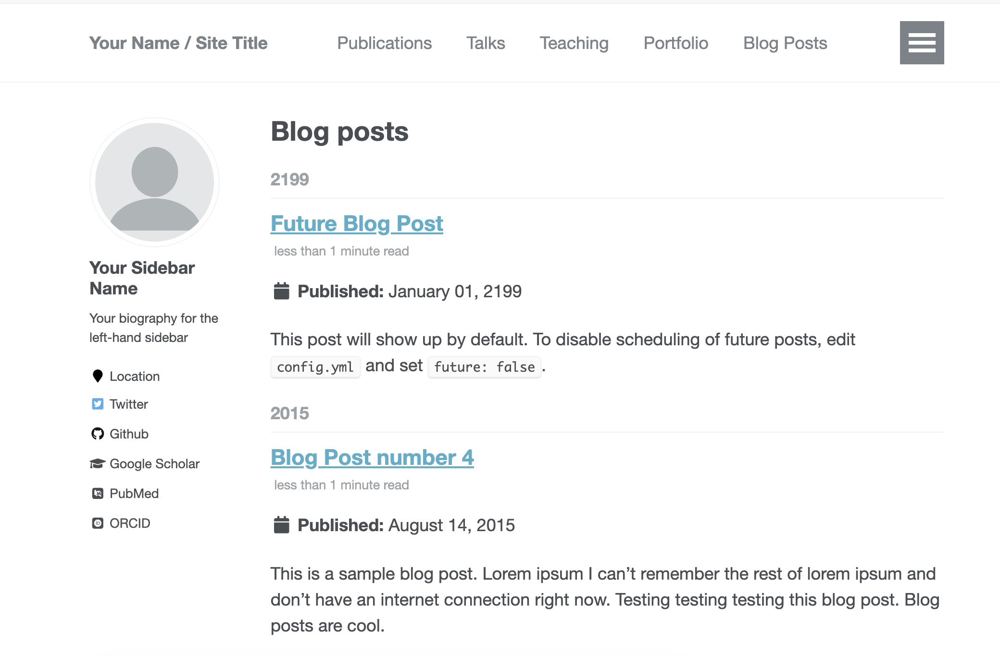
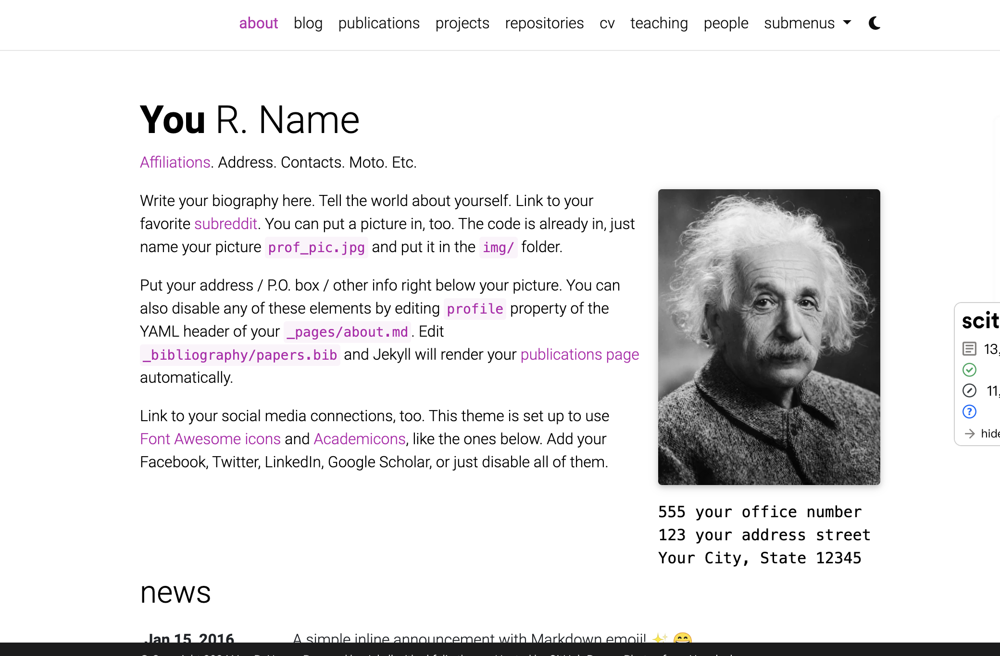

## 1 为什么搭建个人的网站？

这是一项自己不熟悉的领域、预计会花比较多的时间去完成这一任务。花费那么多精力去做这件事情是为了什么呢

1. 为了分享知识，根据费曼的学习法则，只有将学会的东西传授给别人，才算懂。要抱着可以教给别人的态度，去学习新知识。否则，该忘记的还是要忘记。这就是传授、实践之后才能掌握。
2. 写作，写作是表达自己思想的主要方式，也能起到整理自己思想的目的。把问题说清楚的关键，在于你的思想是否清楚。
3. 推广自己，通过自己学习到的知识再通过技术博客分享出去。让别人知道你，是人脉的积累。

最终目的就是能得到能力和专业的提升，在以后的职业生涯中，可以实现自己的人生价值。之后社会为我的价值支付的价格，可以支撑我过上体面的生活。

## 2 如何搭建个人网站？
### 2.1 预期投入时间和完成指标
就我个人而言，需要在2024年的第五周初步完成这一工作，之后再继续添加内容、完善。
就像Obsidian这样，有迹可循的。

- 计划投入6个小时，分为四部分
	1.  确定使用的博客或者个人网站框架 1小时
	2.  确定使用github.io 或者是学校提供的服务器 0.5小时
	3.  搭建好网站，并充实内容。仿照该网址[^1]，并参考姜庆彩师兄[^2]和肖杰的个人网站[^3]。 2小时
	4. 并写一篇blog，关于git的。

### 2.2 选择博客风格和构建方案

[How I Built my Blog using MDX, Next.js, and React (joshwcomeau.com)](https://www.joshwcomeau.com/blog/how-i-built-my-blog/) 该方案太过于专业，专注于前端。搞懂的话，需要花费自己太多的时间，且并不符合我的需求，为学术和专业服务，不同于有的专家发布于bilibili等平台上，他们有自己的名气专注于文字或者创作本身。我恰巧懂点计算机和markdown和网页的知识，可以做一个academic homapage的主页，为我服务。

#### 2.2.1 可选择的方案
1. [academicpages/academicpages.github.io: Github Pages template for academic personal websites, forked from mmistakes/minimal-mistakes](https://github.com/academicpages/academicpages.github.io)
比较简单, 且朴素
2. [Academic (academic-demo.netlify.app)](https://academic-demo.netlify.app/)

看着现代一点，但是没有blog或者post的分页，而是集中在一起。这也是[Ioannis Nikiteas](https://gnikit.github.io/) 使用的方案。分页的功能需要赞助哦。[HugoBlox/theme-academic-cv: 🎓 无需编写任何代码即可轻松创建漂亮的学术网站 Easily create a beautiful academic résumé or educational website using Hugo and GitHub. No code.](https://github.com/HugoBlox/theme-academic-cv) 

3. [Material for MkDocs (squidfunk.github.io)](https://squidfunk.github.io/mkdocs-material/) 姜庆彩师兄使用的就是这个方案，纯markdown

1. [alshedivat/al-folio: A beautiful, simple, clean, and responsive Jekyll theme for academics (github.com)](https://github.com/alshedivat/al-folio) 
符合需求！选择这一方案构建个人主页！

#### 2.2.2 配合github.io使用

跟随这个引导做即可。[al-folio/INSTALL.md at master · alshedivat/al-folio (github.com)](https://github.com/alshedivat/al-folio/blob/master/INSTALL.md)

### 2.3 构建细节

1. 参考github pages的指南[^4]，必须使用自己的用户名`1jungu`而不是`jungu` 否则会出现http://1jungu.github.io/jungu.github.io 必须要用自己的用户名
2. 注意yaml这个东西`:`与`#` 注释符号之间需要有空格。否则会造成意外的情况，具体到本次事件中，会造成网站渲染不正确。
3.  图片显示使用图床，还是本地服务; 因为自己使用obsidian做笔记，所以分享出去尽量也用本地图片。这就需要自己去更新图片。

---
[^1]: [Gnikit](https://gnikit.github.io/)
[^2]: [Qingcai Jiang's homepage](https://qcjiang.github.io/)
[^3]: [Jie Xiao](https://jiexiaou.github.io/)
[^4]: [Quickstart for GitHub Pages - GitHub Docs](https://docs.github.com/en/pages/quickstart)
